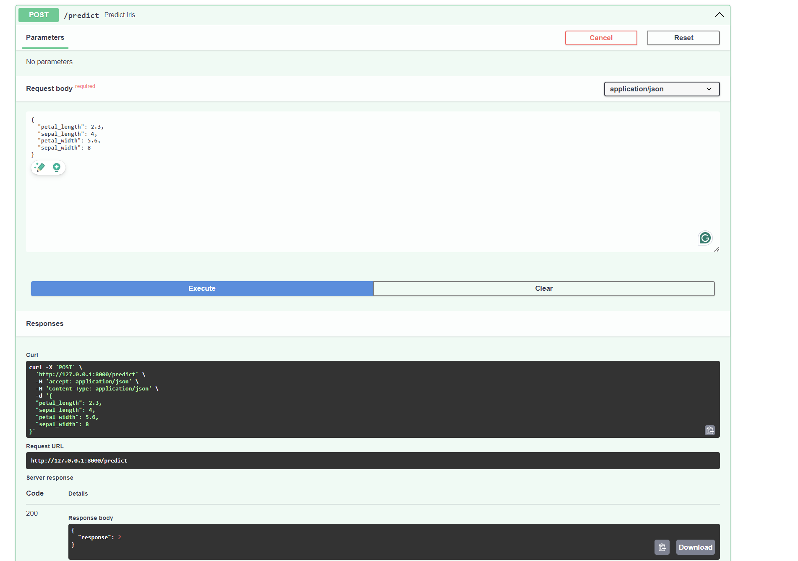
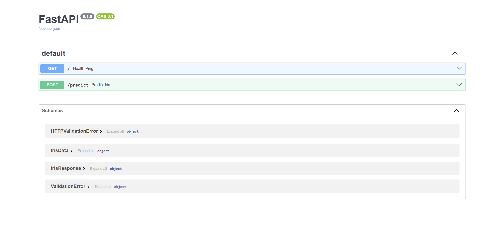

# 🍷 Wine Quality Classifier — FastAPI Lab

> **IE7374 MLOps · Lab Assignment 3-Harini Prasad Vasisht**  
> Demonstrates how to expose a trained scikit-learn model as a REST API using **FastAPI** and **Uvicorn**, complete with a frontend UI.

---

## 📌 Overview

This lab trains a **Random Forest Classifier** on the UCI Wine dataset and wraps it in a FastAPI service. The API accepts 13 chemical properties of a wine sample and returns a predicted class with confidence probabilities. A browser-based UI is included to test predictions interactively.

**Key modifications from the base lab:**
- Uses the **Wine dataset** instead of Motor Vehicle Thefts
- Added a `/batch` endpoint for multi-sample predictions
- Returns **class probabilities** alongside the predicted class
- Includes a `/info` endpoint for model introspection
- Built a **frontend UI** at `/ui` to test the API in the browser

---

## 🗂 Project Structure
```
FastAPI_Labs/
├── src/
│   ├── train.py          # Train & save the model
│   ├── main.py           # FastAPI application
│   └── static/
│       └── index.html    # Frontend UI
├── model/
│   ├── wine_classifier.pkl
│   └── scaler.pkl
├── requirements.txt
└── README.md
```

---

## ⚙️ Setup
```bash
python3 -m venv venv
source venv/bin/activate
pip install -r requirements.txt
```

---

## 🏋️ Train the Model
```bash
cd src
python3 train.py
```

---

## 🚀 Run the API
```bash
cd src
uvicorn main:app --reload
```

| URL | Description |
|-----|-------------|
| http://127.0.0.1:8000 | Health check |
| http://127.0.0.1:8000/docs | Swagger UI |
| http://127.0.0.1:8000/ui | Frontend UI |

---

## 📡 Endpoints

| Method | Endpoint | Description |
|--------|----------|-------------|
| GET | `/` | Health check |
| GET | `/info` | Model metadata |
| POST | `/predict` | Predict one wine sample |
| POST | `/batch` | Predict multiple samples |

---

## 📚 Key Concepts

- **FastAPI** — Modern Python web framework with auto-generated docs
- **Uvicorn** — ASGI server to run FastAPI
- **Pydantic** — Data validation via Python type hints
- **StandardScaler** — Normalizes features before inference
- **pickle** — Serializes and deserializes the trained model

## 📸 Screenshots

### Frontend UI


### Prediction Result


### API Response


### Swagger Docs
