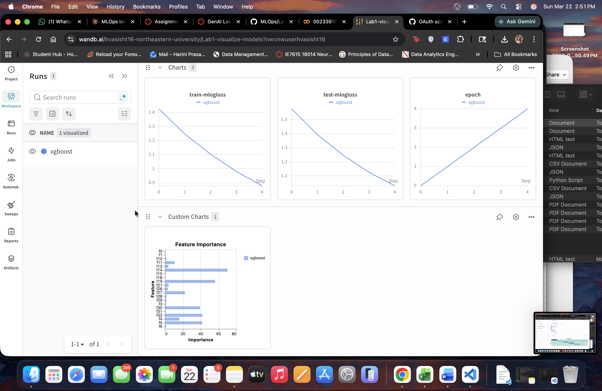
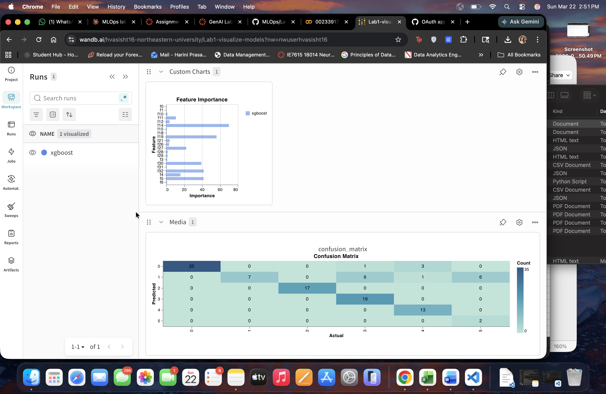
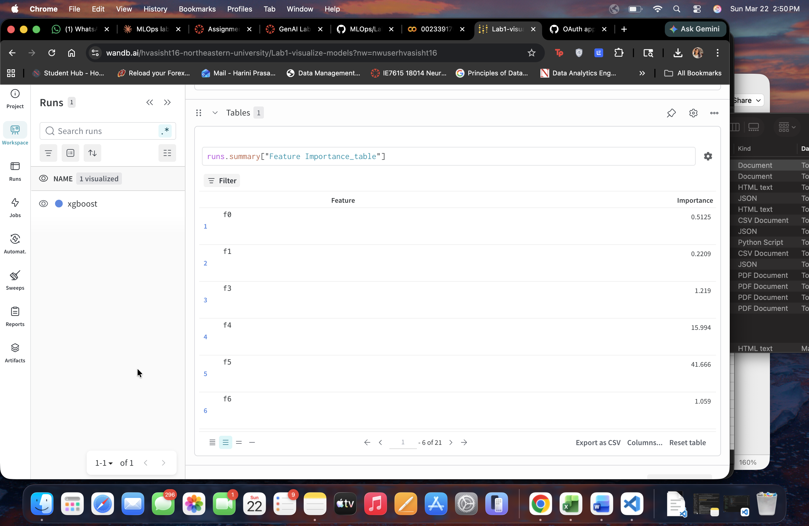

# MLOps Lab 1 - Visualizing Models with W&B

**Author:** Harini Prasad Vasisht

## Objective
Train an XGBoost classifier on the UCI Dermatology dataset and visualize results using Weights & Biases (wandb).

## Setup
```bash
pip install wandb xgboost numpy
```

## How to Run
1. Open `Lab1.ipynb` in Google Colab
2. Run all cells
3. Login to your W&B account when prompted

## Results
- **Test Error Rate:** 0.1545 (15.45%)
- **Rounds trained:** 5
- **Model:** XGBoost (multi:softmax)

## W&B Dashboard Screenshots

### Training & Test Loss + Feature Importance Charts


### Feature Importance (Custom Chart) + Confusion Matrix


### Feature Importance Table
