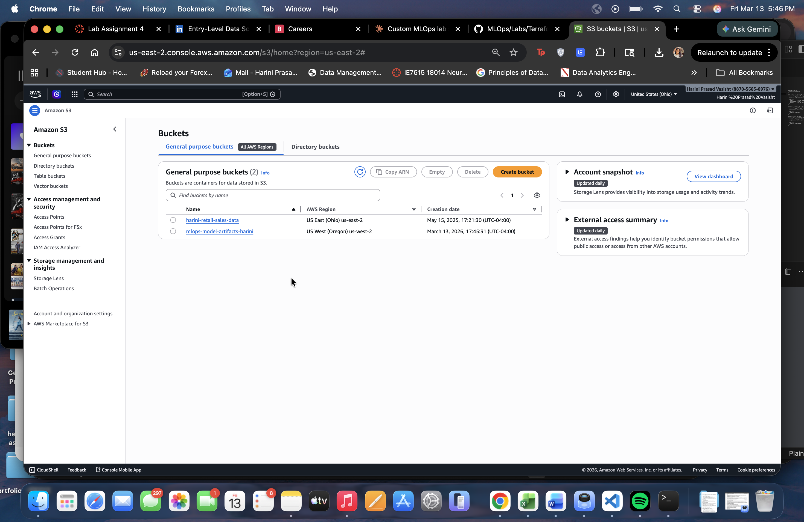
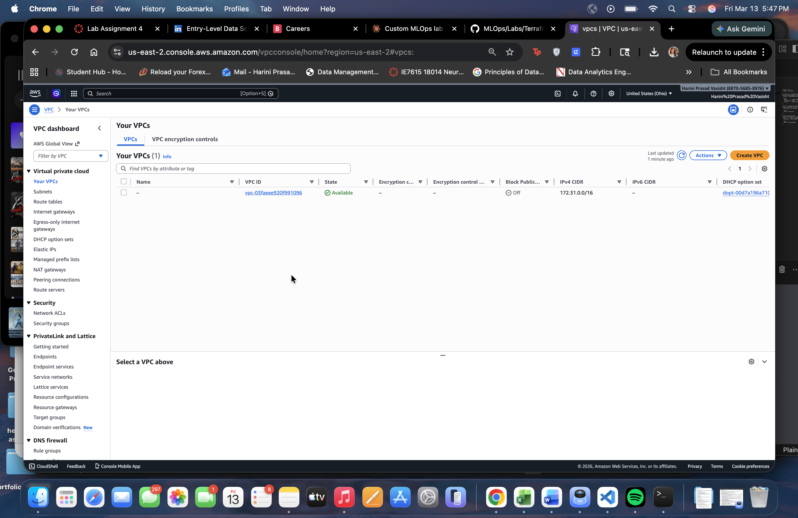
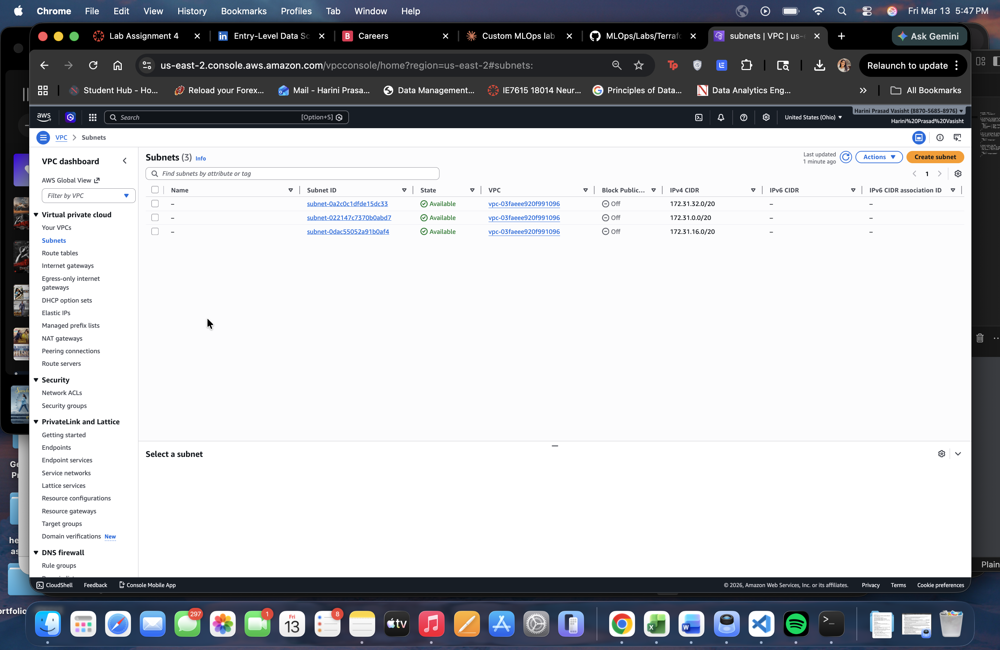

# My MLOps Terraform Lab - AWS Infrastructure

**Author:** Harini Prasad Vasisht  
**Date:** March 13, 2026  
**Tool:** Terraform v1.14.7  
**Cloud:** AWS (us-west-2)

---

## What I Built

For this lab, I used Terraform to provision real AWS infrastructure from my terminal on a Mac. Instead of following the original lab which creates an EC2 instance, I decided to build something more relevant to MLOps — an **S3 bucket for storing machine learning model artifacts**, along with a **VPC and subnet** to simulate an isolated ML workload environment.

I also enabled **S3 versioning**, which is useful in MLOps because it lets you track different versions of trained models stored in S3 — similar to how Git tracks code changes.

### Resources I created:
- **S3 Bucket** (`mlops-model-artifacts-harini`) — for storing ML model files
- **S3 Versioning** — enabled on the bucket for model version tracking
- **VPC** (`mlops-vpc`) — isolated network for ML workloads
- **Subnet** (`mlops-subnet`) — subnet inside the VPC

---

## Proof — AWS Console Screenshots

### S3 Bucket


### VPC


### Subnet


---

## How I Did It (Step by Step)

### 1. Installed Terraform on my Mac using Homebrew

```bash
brew tap hashicorp/tap
brew install hashicorp/tap/terraform
terraform --version
# Terraform v1.14.7
```

### 2. Set my AWS credentials in the terminal

```bash
export AWS_ACCESS_KEY_ID=<your-access-key-id>
export AWS_SECRET_ACCESS_KEY=<your-secret-access-key>
```

### 3. Created my project folder

```bash
mkdir mlops-terraform-lab
cd mlops-terraform-lab
```

### 4. Wrote my `main.tf` configuration file

This is where I defined all my AWS resources. See `main.tf` in this folder for the full code.

### 5. Initialized Terraform

```bash
terraform init
```

This downloaded the AWS provider plugin.

### 6. Previewed what Terraform would create

```bash
terraform plan
```

Output showed 3 resources to be created: S3 bucket, VPC, subnet.

### 7. Applied the configuration

```bash
terraform apply
# type yes when prompted
```

All 3 resources were created successfully in AWS.

### 8. Added S3 versioning and applied again

```bash
terraform apply
# type yes when prompted
```

This added the versioning configuration to the S3 bucket.

### 9. Destroyed everything to avoid charges

```bash
terraform destroy
# type yes when prompted
```

All 4 resources were destroyed.

---

## How to Run This on Your Own System

### Prerequisites
- A Mac, Linux, or Windows machine
- An AWS account (free tier is fine)
- Terraform installed — get it here: https://developer.hashicorp.com/terraform/tutorials/aws-get-started/install-cli

**On Mac**, install Terraform with:
```bash
brew tap hashicorp/tap
brew install hashicorp/tap/terraform
```

**On Windows**, download the installer from the link above.

### Step 1 — Clone this repo

```bash
git clone https://github.com/hvasisht/MLOps.git
cd MLOps/Labs/Terraform_Labs/AWS/Lab1_Beginner
```

### Step 2 — Set your AWS credentials

Go to your AWS Console → click your name → Security Credentials → Create access key. Then run:

```bash
export AWS_ACCESS_KEY_ID=your-key-here
export AWS_SECRET_ACCESS_KEY=your-secret-here
```

### Step 3 — Initialize Terraform

```bash
terraform init
```

### Step 4 — Preview the plan

```bash
terraform plan
```

You should see 4 resources to be created.

### Step 5 — Apply the configuration

```bash
terraform apply
```

Type `yes` when prompted.

### Step 6 — Verify in AWS Console

1. Go to **S3** → you should see `mlops-model-artifacts-harini` bucket
2. Go to **VPC** → switch region to **US West (Oregon)** → you should see `mlops-vpc`
3. Go to **Subnets** → you should see `mlops-subnet`
4. Click on the S3 bucket → **Properties** tab → confirm **Versioning** is Enabled

### Step 7 — Destroy when done

```bash
terraform destroy
```

Type `yes` to confirm. This removes all resources and avoids any AWS charges.

---

## What Makes This Different from the Original Lab

| Original Lab | My Version |
|---|---|
| Creates an EC2 instance | Creates an S3 bucket for ML model storage |
| Region: us-east-1 | Region: us-west-2 |
| No versioning | S3 versioning enabled for model tracking |
| CIDR: 10.0.0.0/16 | CIDR: 10.1.0.0/16 |
| Generic resource names | MLOps-themed names and tags |
| Tags not used | Tags include Environment and Project fields |

The S3 + versioning approach is more relevant to MLOps because in real ML pipelines, S3 is commonly used to store datasets, trained models, and pipeline outputs — and versioning helps teams roll back to previous model versions when needed.
